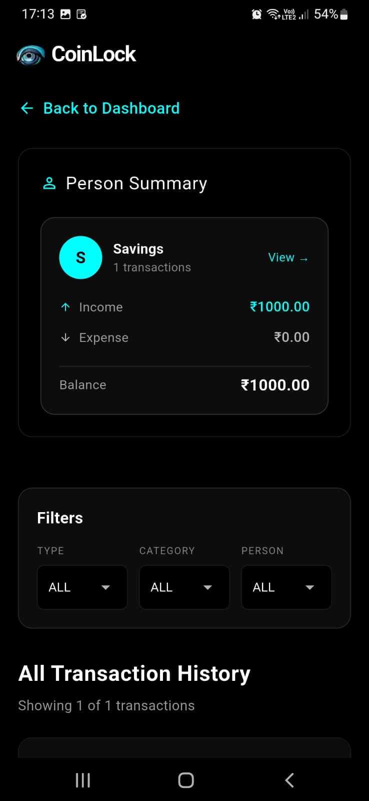
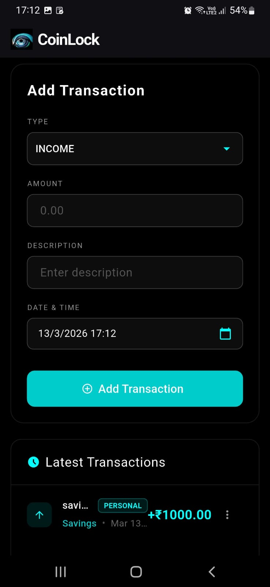
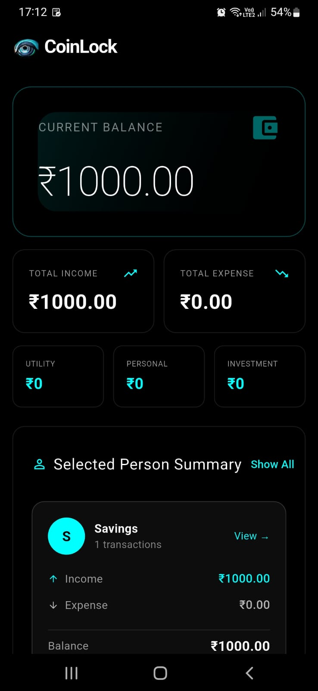

<p align="center">
  
</p>

<h1 align="center">CoinLock</h1>
<p align="center">A privacy-first offline expense tracker that stores
all data locally on your device without any cloud sync.</p>

<p align="center">
  <a href="../../releases/latest">
    
  </a>
</p>

<p align="center">
  
</p>

---

<p align="center">
  
  
  
</p>

A clean, dark-themed personal finance tracker that helps you monitor income and expenses, categorize transactions, and view per-person spending summaries — all stored locally on your device with **zero cloud dependency**.

**This project is entirely free and open-source.** Feel free to fork, copy, enhance, or submit pull requests - do whatever you want with it!
 
 **Note:**
 The app includes a small set of **demo transactions**  to showcase how the interface works on first launch.  
These entries can be **deleted anytime** from the **Latest Transactions** section at the bottom of the dashboard.
## Installation

You have two options:

1. **Ready-to-install APK** - Grab the latest APK from the [Releases](../../releases) page and install it directly
2. **Build from Source** - Follow the quick start guide below to build it yourself

## Core Features

| Feature | Description |
|---------|--------|
| **Dashboard** | At-a-glance summary of income, expenses, and net balance |
| **Local Storage** | Data is automatically saved to the device's file system (JSON) |
| **Categories** | Classify transactions as Utility, Personal, or Investment |
| **History & Filters**| Full history with powerful filters (by type, category, and person) |

## What's Included

| Component | Status |
|---------|--------|
| **Mobile Support** | ✅ Works (Android) |
| **Web Support** | ✅ Works (SharedPreferences) |
| **Dark Theme** | ✅ Works |
| **Cloud Sync** | ❌ Disabled (Privacy-first) |

## Requirements

### Windows / macOS / Linux
You will need the Flutter SDK and Dart to build the app from source:
```bash
# Verify flutter installation
flutter doctor
```

## Quick Start

1. **Clone the repository:**
   ```bash
   git clone https://github.com/febin1653/coinlock.git
   cd coinlock
   ```

2. **Install dependencies:**
   ```bash
   flutter pub get
   ```

3. **Generate launcher icons:**
   ```bash
   dart run flutter_launcher_icons
   ```

4. **Run the app:**
   ```bash
   flutter run
   ```

## File Structure

```
coinlock/
├── lib/
│   ├── main.dart                        # App entry point
│   ├── models/                          # Data models
│   ├── screens/                         # UI screens and views
│   └── services/                        # Local storage services
├── assets/                              # Images and seed data
├── android/                             # Android specific files
└── pubspec.yaml                         # Flutter dependencies
```

## How It Works

### Local Storage
Uses `path_provider` to store data in a JSON file (`expenses.json`) on Mobile, and uses `shared_preferences` for the Web version. The app is completely offline and preserves your privacy.

### User Interface
Built using Flutter's built-in widget toolkit with a custom dark theme (`brightness: Brightness.dark`) and a sleek design tailored for expense tracking.

## Contributing

This is a personal project I'm sharing with the community. Contributions are welcome!

- 🍴 **Fork it** - Make your own version
- 🔧 **Pull requests** - Improvements and fixes are appreciated
- 📋 **Copy it** - Use the code however you want
- ✨ **Enhance it** - Build something even better

## License

This project is released under the MIT License - you can do whatever you want with it. See [LICENSE](LICENSE) for details.
